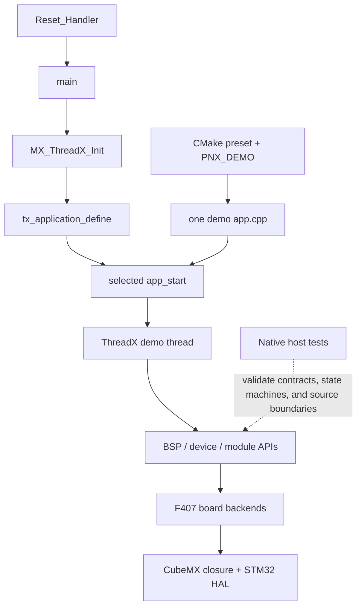

# Pure-F407 State Snapshot

This document is the architecture-review snapshot of the pure-F407 DJI
C-board repository before formal BMI088 + IST8310 integration. It describes
the repository as it exists; it is not an integration design, a release
announcement, or new validation evidence.

## 1. Repository identity

| Field | Value |
|---|---|
| Repository role | Active pure-F407 DJI C-board product workspace |
| Branch | `checkpoint/pure-f407-pre-sensor-integration` |
| Snapshot source commit | `105a416516b88f502ffaf56290e07b23194fcd13` |
| Validated firmware commit | `730b987c12f8951e8b0e2a0d1b9e655d0a585dff` |
| Baseline tag | Annotated tag `pure-f407-pre-integration-baseline`, peeled target `105a416516b88f502ffaf56290e07b23194fcd13` |
| Product board | DJI C-board, STM32F407 |
| Formal BMI088 + IST8310 integration | `NOT_DONE` |
| Team publication | `NOT_PUBLISHED` |

The tag target is a documentation commit that records the lean regression.
The firmware exercised by that regression is its parent,
`730b987c12f8951e8b0e2a0d1b9e655d0a585dff`. The distinction matters when
reproducing the result.

The four public framework repositories remain exact Git submodules. This
product repository must not copy, vendor, or create F407-only forks of them.

| Submodule | Exact gitlink | Responsibility in this repository |
|---|---|---|
| `pnx_bsp` | `f61e8ac8ac4b75d93b021ec32a8ecf56fc36a73b` | Hardware-independent BSP contracts and shared implementations; F407 hardware details terminate at the board backend boundary |
| `pnx_devices` | `14ec349a242a2c17de1cb9d0e2968c73c61fb0fd` | Reusable device drivers, including motors and IMU devices |
| `pnx_libs` | `55bd94060b7be562ce7a6773822a6a4d2bcab9c0` | Common control, math, filtering, messaging, CRC, and runtime utilities |
| `pnx_modules` | `45d3725b486fde00ebffd4473a2600ae3f4acacf` | Higher-level motor, referee, remote-control, and AHRS modules |

Shared API or framework changes originate in the multiboard authority
`../pnx_h7_f4` and are promoted here only after acceptance. Board-specific
F407 development and validation happen in this repository.

## 2. Capability status

Evidence classes used below:

- **Current software regression**: executed against firmware commit
  `730b987...` and recorded by the tagged documentation commit `105a416...`.
- **Retained hardware evidence**: an earlier attended observation retained in
  `docs/VALIDATION.md` and `HANDOFF.md`; it was not rerun for this snapshot.
- **Isolated lab**: a bounded, non-production configuration or demo. Passing
  it does not mean the capability is integrated into the daily firmware.

| Capability | Status | Evidence class and boundary |
|---|---|---|
| Six official F407 presets | `PASS` (6/6) | Current software regression; Debug/Release Board Smoke, CAN RX, motor-safe, and USB CDC |
| Complete host suite | `PASS` (39/39, 0 failed, 0 skipped) | Current software regression |
| F407-only/no-H723 graph Gate | `PASS` | Current software regression |
| CubeMX production Gate | `PASS` | Current software regression |
| F407 board-boundary Gate | `PASS` | Current software regression |
| PWM, BMI088, IST8310 lab builds | `PASS` (3/3) | Current software regression; each produced an ELF |
| Compiler/linker warnings | `0` | Current six-preset and three-lab regression |
| Startup through `app_start` | `PASS` | Retained Board Smoke hardware evidence |
| ThreadX, DWT, stack/fault baseline | `PASS` | Retained Board Smoke hardware evidence |
| Green LED heartbeat and debug reset recovery | `PASS` | Retained Board Smoke hardware evidence |
| USB CDC enumeration, bidirectional data, reopen/reset re-enumeration | `ISOLATED_LAB_PASS` | Retained hardware evidence using local-only `VID=0xCAFE`, `PID=0xF407`; not a production identity |
| Production USB identity | `UNASSIGNED_FAIL_CLOSED` | Tracked presets retain identity confirmation OFF, VID/PID `0x0000`, serial `UNASSIGNED`, and controller stopped |
| CAN1 receive | `PASS` | Retained hardware evidence; high-rate receive completed without reported error/drop |
| M2006 bounded actuation | `PASS` | Retained isolated hardware test; one `+500` raw, maximum 250 ms pulse, then automatic zero |
| Default motor output | `ZERO / FAIL_CLOSED` | Non-zero output is compile-gated, explicitly configured, one-shot armed, bounded, and latched |
| PWM C2 servo | `BOUNDED_PHYSICAL_OBSERVATION_PASS` | Retained isolated lab; four small movements observed, no quantitative angle/load claim |
| BMI088 | `LAB_PASS` | Retained replacement-board SPI1 lab; first-board no-response remains valid negative evidence |
| IST8310 | `LAB_PASS` | Retained I2C3 lab with identity, changing samples, and zero reported transfer fault |
| UART physical capture | `SKIPPED_BY_USER_NOT_BLOCKING` | MCU initialization/transmit activity is not a physical capture result |
| CAN2 | `NOT_RUN_OPTIONAL` | Not required by the current product acceptance boundary |
| DBUS | `NOT_IMPLEMENTED_NOT_RUN` | No current implementation claim |
| MaixCam | `NOT_RUN` | Deferred peripheral integration |
| AHRS / attitude fusion | `OUT_OF_SCOPE` | Explicitly excluded from the next sensor-integration boundary |
| Formal shared BMI088 + IST8310 runtime | `NOT_DONE` | Individual lab success is not daily-firmware integration |
| Team release | `NOT_PUBLISHED` | No team delivery claim |

## 3. Actual architecture

The product is one F407 firmware repository with configure-time demo
selection. It is not a runtime plugin system and it is not an H7/F4
multiboard user surface.



The concrete layers are:

1. `boards/dji_c_board_f407/` owns the startup file, linker/MCU closure,
   CubeMX-generated production tree, ThreadX/USBX glue, and F407 HAL backends.
2. `demo/cboard/` owns product demos and their `app_start` entry points.
   Exactly one `demo/cboard/${PNX_DEMO}/app.cpp` enters an embedded build.
3. `pnx_bsp` exposes hardware-neutral interfaces. Board backends implement the
   hardware side without changing those public contracts.
4. `pnx_devices`, `pnx_modules`, and `pnx_libs` provide reusable device,
   service, and utility layers at their pinned submodule revisions.
5. `tests/host/` builds natively and does not enter the embedded source graph.
   It tests pure logic, state machines, and static source/configuration
   acceptance boundaries with host-side harnesses.

The configure step emits `f407-actual-target-sources.txt` and asks the CubeMX
Gate to inspect the real target graph. This is the authoritative boundary
against accidental H723 or legacy-board source inclusion.

## 4. Build and runtime entry points

### Official build interface

| Preset | Selected demo | Build type | Output directory |
|---|---|---|---|
| `board-smoke` | `board_smoke` | Debug | `build/dji-c-board` |
| `can-rx` | `can_receive` | Debug | `build/dji-c-board-can-rx` |
| `motor-safe` | `motor_safe` | Debug | `build/dji-c-board-motor-safe` |
| `board-smoke-release` | `board_smoke` | Release | `build/dji-c-board-release` |
| `usb-cdc` | `usb_cdc` | Debug | `build/dji-c-board-usb-cdc` |
| `usb-cdc-release` | `usb_cdc` | Release | `build/dji-c-board-usb-cdc-release` |

The standard wrappers are:

```powershell
powershell -NoProfile -ExecutionPolicy Bypass -File scripts/build_dji_c_board.ps1
powershell -NoProfile -ExecutionPolicy Bypass -File scripts/test_host.ps1
```

The static and boundary Gates are:

```powershell
python -B scripts/check_f407_only.py --repo-root . --promoted-workspace
python -B scripts/check_cubemx_production.py --repo-root . --check-submodules-clean
powershell -NoProfile -ExecutionPolicy Bypass -File scripts/check_board_boundaries.ps1
```

Lab demos use the existing `board-smoke` toolchain interface but a separate
ignored binary directory:

```powershell
cmake --fresh --preset board-smoke -B build/dji-c-board-pwm-servo-lab -DPNX_DEMO=pwm_servo_lab
cmake --build build/dji-c-board-pwm-servo-lab

cmake --fresh --preset board-smoke -B build/dji-c-board-bmi088-lab -DPNX_DEMO=imu_bmi088_lab
cmake --build build/dji-c-board-bmi088-lab

cmake --fresh --preset board-smoke -B build/dji-c-board-ist8310-lab -DPNX_DEMO=ist8310_mag_lab
cmake --build build/dji-c-board-ist8310-lab
```

### Authoritative embedded inputs

| Input | Path |
|---|---|
| Product build selection and safety gates | `CMakeLists.txt`, `CMakePresets.json` |
| Production IOC | `boards/dji_c_board_f407/dji_c_board_f407.ioc` |
| CubeMX production closure | `boards/dji_c_board_f407/cmake/stm32cubemx/` and the generated board tree |
| Board parameters | `configs/boards/dji_c_board_f407/params.json` |
| Robot configuration | `configs/boards/dji_c_board_f407/robot.json` |
| Startup | `boards/dji_c_board_f407/startup_stm32f407xx.s` |
| MCU initialization | `boards/dji_c_board_f407/Core/Src/main.c` |
| ThreadX application definition | `boards/dji_c_board_f407/AZURE_RTOS/App/app_azure_rtos.c` |
| Board-specific BSP implementations | `boards/dji_c_board_f407/pnx_backends/` |
| Selected runtime application | `demo/cboard/${PNX_DEMO}/app.cpp` |

## 5. Major flows

### 5.1 Startup and ThreadX dispatch

`Reset_Handler` establishes the runtime memory image, calls `SystemInit`,
`__libc_init_array`, and then `main`. `main` boots diagnostics, initializes
HAL, clocks, GPIO, DMA, CAN1/CAN2, USART3/USART6/USART1, conditionally USB,
and finally calls `MX_ThreadX_Init`.

The ThreadX kernel invokes `tx_application_define`, which creates the
application byte pool, initializes the ThreadX application layer,
conditionally creates the USBX pool/device stack, and calls the one selected
demo's `app_start`. Each demo creates its own ThreadX thread. Board Smoke
publishes heartbeat, tick, DWT, stack, reset, crash, UART, and fault state
through `demo_debug_instance`.

### 5.2 CAN and DJI motor service

The HAL FIFO0 interrupt callback maps the HAL handle to a BSP bus and drains
all pending FIFO0 frames. Every valid frame crosses
`bsp::can::detail::rx_from_isr`; the registered DJI service callback enqueues
it into a bounded per-bus ISR-safe ring.

The `dji_motor_service` ThreadX worker drains the queues, decodes DJI
feedback, maintains online/latest-feedback state, and publishes a snapshot.
`can_receive` runs the service in receive-only mode. `motor_safe` adds guarded
command output: compile-time non-zero enablement, explicit bus/ID/model/current
configuration, stable feedback, exact arm token, one-shot pulse limit,
automatic zero, latch, timeout, and fault handling. Motor telemetry is copied
to the debugger-visible state.

### 5.3 USB CDC

USBX CDC activate/deactivate callbacks only update an atomic pending
connection event and wake the worker. The ThreadX worker publishes the
connection transition into the shared BSP, services queued TX, and reports TX
completion. RX crosses the backend boundary into the configured BSP callback.
This deferral keeps shared state/locking work out of USBX callback context.

The production controller remains stopped unless
`PNX_USB_DEVICE_IDENTITY_CONFIRMED` is true with a non-zero authorized VID/PID
and assigned serial. The retained `0xCAFE/0xF407` evidence belongs only to an
ignored, isolated lab configuration.

### 5.4 PWM lab

`pwm_servo_lab::app_start` creates one ThreadX thread. No PWM output begins
until the debugger-visible `pnx_pwm_lab_arm_token` receives the exact lab
token. The demo then initializes TIM1/PE11 directly and runs one deterministic
`1500, 1450, 1500, 1550, 1500 us` sequence. It exposes state, pulse, step,
fault, and heartbeat counters and latches completion; it is not a general
servo service.

### 5.5 BMI088 and IST8310 labs

The BMI088 lab creates one ThreadX sampling thread, directly configures SPI1
and its GPIO/chip-select lines, validates both chip IDs, periodically reads
six raw axes, and exposes IDs, samples, sample/change counts, state, faults,
and heartbeat.

The IST8310 lab creates one ThreadX sampling thread, directly configures I2C3,
GPIO, and reset, validates `WHO_AM_I`, triggers/reads measurements, and
exposes raw XYZ, sample/change counts, state, transfer errors, faults, and
heartbeat.

These two flows currently coexist only as separate build-selected labs, never
as one daily firmware image.

## 6. Lab versus formal boundary

The PWM and sensor demos intentionally proved board wiring and minimum
runtime behavior without first changing the production configuration:

| Lab | Local hardware closure | What it proves | What it does not prove |
|---|---|---|---|
| `pwm_servo_lab` | Direct TIM1/PE11 register setup | Bounded PWM output can move the attached servo | Production PWM service, calibrated angle/load behavior, or IOC ownership |
| `imu_bmi088_lab` | Direct SPI1/GPIO/chip-select setup | Replacement-board BMI088 identities and changing raw samples | Shared BMI088 driver integration, production SPI ownership, calibrated data, or fusion |
| `ist8310_mag_lab` | Direct I2C3/GPIO/reset setup | IST8310 identity and changing raw samples | Production driver/service integration, calibration, or fusion |

The tracked production IOC has no SPI1, I2C3, or TIM1 peripheral closure.
Therefore copying the lab register initialization into a daily demo would not
constitute formal integration.

The existing shared BMI088 implementation in
`pnx_devices/imu/bmi088/src/bmi088.cpp` currently selects
`bsp::spi::bus::spi2`, while the proven C-board lab uses SPI1. No IST8310
shared device implementation exists in the pinned `pnx_devices`,
`pnx_modules`, or `pnx_bsp` trees.

Formal integration requires an accepted ownership boundary for production
configuration, bus/CS/reset lifecycle, device APIs, ThreadX lifecycle,
status/fault reporting, and tests. Until then:

```text
BMI088_LAB=PASS
IST8310_LAB=PASS
FORMAL_COMMON_SENSOR_RUNTIME=NOT_DONE
AHRS=OUT_OF_SCOPE
```

## 7. Complexity and simplification candidates

This is a review inventory, not an instruction to refactor immediately.
Safety and boundary code must not be removed merely because the pure-F407
product currently has one board implementation.

| File / symbol | Current callers | Purpose and complexity | Required preservation evidence | Classification |
|---|---|---|---|---|
| `pnx_modules/motor/src/dji_motor_service.cpp` / `dji_motor_service` | `can_receive`, `motor_safe` | Owns per-bus ISR rings, worker thread, feedback state, online detection, recovery/fault state, safe grouping, arm/latch/timeout, and command telemetry | CAN receive tests, motor arm-guard tests, zero-default build Gate, and bounded motor evidence | **retain** |
| `demo/cboard/motor_safe/app.cpp` / compile and arm gates | `motor_safe` only | Keeps non-zero output behind explicit compile configuration, feedback qualification, exact one-shot arm, bounded current/time, and automatic zero; optional USB arm also requires confirmed identity | Motor guard, USB arm parser/source tests, default-zero configuration, and timeout/dropout cases | **retain** |
| `boards/dji_c_board_f407/pnx_backends/usb_backend.cpp` / callback deferral | USB BSP/USBX | Separates USBX callback context from BSP locking/state transitions using atomics and a worker thread | USB backend/source acceptance, CDC harness, connect/disconnect, RX/TX, and fail-closed identity tests | **retain** |
| `boards/dji_c_board_f407/pnx_backends/can_backend.cpp` / FIFO0 drain | HAL CAN callback | Drains every pending frame in ISR context and forwards normalized frames while accounting for failures | CAN backend source acceptance, host CAN tests, and retained high-rate CAN1 evidence | **retain** |
| `pnx_bsp/*` backend interfaces and `boards/.../pnx_backends/*` | Shared BSP plus F407 production target; host fakes use the same contracts | Preserves public shared-module authority and isolates F407 HAL details even though this product has one board | F407 boundary/no-H723 Gates, host backend harnesses, and multiboard-source compatibility | **retain** |
| `demo/cboard/common/cboard_demo_debug.hpp` / `debug_state` ABI 4 | Board Smoke, CAN, motor, USB, and lab demos | One broad debugger ABI centralizes startup, fault, ThreadX, CAN, motor, and USB observations; sensors currently expose additional standalone globals | Existing GDB/hardware evidence and source acceptance depend on stable observable fields | **review after sensor integration** |
| `bmi088_lab_protocol.hpp` and `ist8310_lab_protocol.hpp` / `decode_i16`, `sample_changed` | Their respective lab apps and host tests | Small duplicated decode/change helpers; a premature generic sensor abstraction would exceed the current boundary | Preserve both protocol runtime tests until a real common sample contract exists | **review after sensor integration** |
| Demo-local `status_code(types::status)` helpers | Board Smoke, CAN, motor-safe, USB CDC | Repeated trivial conversion used when publishing typed status into the integer debugger ABI | Debug status values and warning-free builds | **likely simplification candidate** |

The likely simplification work should happen only after the formal sensor
boundary is known. Otherwise a cleanup could erase safety evidence or create
an abstraction around two temporary lab shapes.

## 8. Risks

| Risk | Verified fact | Architecture inference | Unresolved unknown |
|---|---|---|---|
| Production configuration gap | Sensor labs directly initialize SPI1/I2C3 and their GPIO; production IOC contains neither peripheral | Formal integration should establish one authoritative production configuration instead of copying the lab closure into another demo | Exact IOC/generated-tree changes and the approved ownership of chip-select/reset GPIO |
| Device and bus ownership | The proven BMI088 path uses SPI1; the pinned shared BMI088 driver hard-codes SPI2; no shared IST8310 driver exists | Integrating without an explicit adapter/API decision can duplicate bus initialization or fork shared drivers | Whether to parameterize the shared BMI088 driver, add a board adapter, and where the IST8310 driver should live |
| Thread timing and blocking | Both labs use polling register transactions with finite wait limits and independent periodic ThreadX loops | Combined worst-case polling and retry work may introduce scheduling jitter or hide a stuck peripheral | Measured transaction/timeout cost, accepted sample rates, thread priorities, and latency budget |
| Partial sensor failure | Each lab currently owns independent init state, faults, globals, and its own thread | Daily firmware needs deterministic initialization and an observable degraded state when only one sensor succeeds | One versus two sensor threads, retry/recovery rules, and whether startup continues after one identity failure |
| Observation/API growth | `debug_state` ABI 4 has no sensor fields while the labs publish separate volatile globals | Adding sensors without a minimum contract could spread duplicated state and repeatedly change the debugger ABI | Which IDs, samples, counters, status, and faults belong in a shared runtime API versus debugger-only evidence |

## 9. Minimal next boundary

The next engineering increment is deliberately smaller than a complete IMU
stack:

1. Place BMI088 and IST8310 in the same daily F407 firmware image.
2. Give both devices an explicit, non-conflicting production ownership model
   for SPI1/I2C3, chip selects, reset, and initialization order.
3. Run them under a defined ThreadX lifecycle with agreed priorities, sample
   periods, bounded transfer waits, and observable failure behavior.
4. Publish only the minimum reviewable state: device identities, raw samples,
   initialized/running/degraded/fault status, sample counts, change counts,
   transfer/timeout counters, and recovery attempts if recovery is approved.
5. Preserve operation and observability of the surviving sensor when the
   other sensor is absent or fails identity/transfer checks.
6. Add software acceptance for the new source/configuration boundary and an
   attended hardware Gate for both identities, changing samples, counters,
   and absence of a reset/fault loop.

Explicitly excluded from this increment:

- AHRS or attitude fusion;
- calibration and coordinate-frame fusion;
- a generic sensor framework;
- PWM or MaixCam integration;
- simplification or modification of `dji_motor_service`;
- changes that fork public BSP/device/module/library code in this repository.

## 10. Architecture-review questions

1. Should SPI1 and I2C3 become authoritative CubeMX production peripherals,
   with the direct-register lab initialization excluded from the daily path?
2. Which layer owns each bus lifecycle and the BMI088 chip-select/IST8310
   reset GPIO: the F407 board backend, the BSP contract, or the device driver?
3. Should the shared BMI088 driver accept an explicit SPI bus/board binding,
   or should the F407 product supply a thin adapter while the shared driver
   remains unchanged?
4. Should a new IST8310 driver originate in `pnx_devices`, and what minimum
   `init/status/read` contract should it share with BMI088 without creating a
   generic sensor framework?
5. Should BMI088 and IST8310 run in one sensor thread or two independent
   threads, and what sample rates and ThreadX priorities are required?
6. What are the accepted startup order, timeout, retry, recovery, and degraded
   behavior when one sensor fails but the other remains healthy?
7. Which minimum sensor fields enter `debug_state` or another formal status
   interface, and does that require an explicit debugger ABI revision?
8. What exact software and attended-hardware evidence changes
   `FORMAL_COMMON_SENSOR_RUNTIME` from `NOT_DONE` to `PASS`, while keeping AHRS
   explicitly out of scope?
